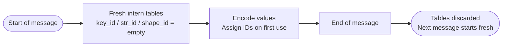

# Core Concepts

This page explains how Twilic's compression mechanisms work at the byte level. Understanding these concepts helps you make the most of Twilic in your application.

## Key Interning

In JSON and MessagePack, every map sends its keys as string literals — even when you're encoding a thousand objects with the same shape.

```json
{ "id": 1001, "name": "alice", "score": 98.6 }
{ "id": 1002, "name": "bob",   "score": 74.1 }
{ "id": 1003, "name": "carol", "score": 88.0 }
```

The keys `"id"`, `"name"`, and `"score"` are sent **three times each** — 4, 6, and 7 bytes per key, plus length prefixes.

Twilic assigns each key a compact integer ID (`key_id`) on first use, and subsequent occurrences are replaced with a 1–3 byte `key_ref`:

| First object                       | Subsequent objects    |
| ---------------------------------- | --------------------- |
| `"id"` (3 bytes) → `key_id = 0`    | `key_ref(0)` (1 byte) |
| `"name"` (5 bytes) → `key_id = 1`  | `key_ref(1)` (1 byte) |
| `"score"` (6 bytes) → `key_id = 2` | `key_ref(2)` (1 byte) |

Key intern tables are **message-local**: they reset at each top-level message boundary. This keeps stateless decoding safe — a decoder never needs session state to decode a single message.

## Shape Interning

When multiple maps share the same key sequence (same keys, same order), Twilic promotes them to a **shaped object** representation. The key sequence is declared once with `shape_def`, and subsequent objects use `shape_ref` which encodes **values only** — no keys at all.

For a 6-field object sent 256 times:

| Encoding           | Per-object overhead          |
| ------------------ | ---------------------------- |
| JSON               | ~60 bytes of keys per object |
| MessagePack        | ~30 bytes of keys per object |
| Twilic (shape_ref) | 1 byte shape ID per object   |

The savings compound with record count. A 256-record batch of 6-field objects saves roughly `(256 − 1) × 30 = 7,650` bytes of key overhead vs MessagePack.

## String Interning

String **values** (not just keys) that repeat within a message are deduplicated via `str_ref`. This is useful for:

- Status fields: `"active"`, `"inactive"`, `"pending"`
- Category fields: `"sensor"`, `"log"`, `"metric"`
- User IDs or region codes that repeat across records

```text
Message with 100 events, each having status: "active"
  → "active" sent once (7 bytes)
  → str_ref used 99 times (1 byte each)
  → saves 594 bytes vs MessagePack
```

## Typed Vectors

Homogeneous primitive arrays (all `u64`, all `f64`, etc.) bypass the standard element-by-element tag encoding and use a single `typed_vec` with a column codec.

Example: 1,000 timestamps as `u64` (milliseconds since epoch, roughly 1,700,000,000,000):

| Encoding                             | Size          |
| ------------------------------------ | ------------- |
| JSON                                 | ~14,000 bytes |
| MessagePack (u64 per element)        | ~9,000 bytes  |
| Twilic `typed_vec` + `DELTA_BITPACK` | ~1,250 bytes  |

Delta encoding reduces values to small deltas (e.g., 100 ms between events), and bitpacking stores each delta in the minimum number of bits.

Available codecs per vector type:

| Codec | Best for |
| --- | --- |
| `DIRECT_BITPACK` | Bounded integer ranges (enum-like values, small IDs) |
| `DELTA_BITPACK` | Monotone or slowly growing sequences (timestamps, sequence numbers) |
| `FOR_BITPACK` | Frame-of-reference (values clustered near a common base) |
| `DELTA_DELTA_BITPACK` | Second-order delta (accelerations, sensor derivatives) |
| `RLE` | Runs of identical values (sparse updates, status flips) |
| `SIMPLE8B` | General-purpose small integers mixed with zeros |
| `XOR_FLOAT` | Float sequences (adjacent values XOR-compressed, then bitpacked) |

## Batch Encoding

Instead of sending one record at a time, Twilic can bundle multiple records into a single message:

### Row Batch (`row_batch`)

Records are stored row-by-row. Shape is declared once; each row encodes only values.

```text
row_batch [shape_id=0] [count=3]
  [1001n] ['alice'] [98.6]
  [1002n] ['bob']   [74.1]
  [1003n] ['carol'] [88.0]
```

Best for: small-to-medium batches where low latency matters.

### Column Batch (`col_batch`)

Records are stored column-by-column. Each column is compressed independently with the codec that fits best.

```text
col_batch [shape_id=0] [count=3]
  col[id]:    DELTA_BITPACK [1001n, 1002n, 1003n]  → tiny delta stream
  col[name]:  DIRECT       ['alice', 'bob', 'carol'] → string list
  col[score]: XOR_FLOAT    [98.6, 74.1, 88.0]       → float XOR stream
```

Best for: large batches where column regularity is high (time series, telemetry, database exports).

## Stateful Compression

When a reliable, ordered channel exists (WebSocket, gRPC stream), Twilic can activate optional stateful forms:

### State Patch

Instead of re-encoding a full object, encode only the fields that changed since the previous message:

```text
Object at t=0:  { id: 1, status: "active",   score: 98.6, region: "us-east" }
Object at t=1:  { id: 1, status: "active",   score: 97.9, region: "us-east" }

state_patch: KEEP id, KEEP status, REPLACE score=97.9, KEEP region
```

If 2 of 20 fields change per tick, state patch reduces payload by 90%.

### Template Batch

For bursts of records with repeated optional-field presence patterns, a registered template describes which fields are present. Each record sends only its present values.

### When to use stateful mode

| Condition                       | Use stateful?      |
| ------------------------------- | ------------------ |
| HTTP request/response           | No — use stateless |
| Message queue                   | No — use stateless |
| WebSocket with ordered delivery | Yes                |
| gRPC bidirectional stream       | Yes                |
| UDP or unreliable transport     | Never              |

## Determinism

All encoding choices in Twilic are **deterministic**: given the same input and the same profile state, the encoder always produces the same bytes. This property is required for:

- Reproducible tests and fuzzing
- Cross-SDK interoperability validation
- Debugging (byte-level diffing of encoder output)

The following choices are fixed by the spec and must not be randomized:

- Integer width selection (smallest valid width)
- Key ID assignment order (first-seen within a message)
- String ID assignment order (first-seen within a message)
- Codec selection for `typed_vec` and `col_batch` columns

## Intern Table Lifecycle



Tables never persist across top-level message boundaries. Stateful session state (`base_id`, `template_id`) is separate and controlled explicitly via session lifecycle operations.
