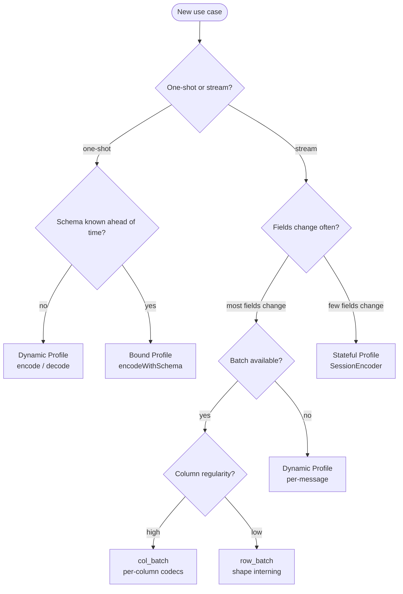

# Cookbook

Practical patterns for common Twilic use cases.

## Telemetry Pipeline

### Problem

An application emits thousands of events per second. Each event has the same shape: `timestamp`, `service`, `level`, `message`, `duration_ms`. Sending each event as a JSON object wastes ~60 bytes of key overhead per event.

### Solution: Column batch

Group events into batches and use `col_batch` so each column is compressed independently.

```ts
import { encodeBatch } from "@twilic/core";

const events = [
  {
    timestamp: 1700000000100n,
    service: "api",
    level: "info",
    message: "request",
    duration_ms: 12,
  },
  {
    timestamp: 1700000000200n,
    service: "api",
    level: "info",
    message: "request",
    duration_ms: 9,
  },
  {
    timestamp: 1700000000350n,
    service: "db",
    level: "warn",
    message: "slow query",
    duration_ms: 230,
  },
  // ... up to 256 events per batch
];

const bytes = encodeBatch(events);
// timestamp column: DELTA_BITPACK (deltas of 100-250ms → tiny)
// service column: string list with dedup
// level column: RLE (long runs of "info")
// duration_ms column: FOR_BITPACK or SIMPLE8B
```

**Size comparison** (256 events, 6 fields):

| Format             | Size     |
| ------------------ | -------- |
| JSON               | ~98 KB   |
| MessagePack        | ~65 KB   |
| Twilic `col_batch` | ~8–12 KB |

### Batch size tuning

- **Latency-sensitive pipelines**: 16–64 records per batch
- **Throughput-optimized pipelines**: 256–1024 records per batch
- **Time series with many numeric columns**: larger batches benefit more from per-column codecs

## API Response with Repeated Structure

### Problem

A REST API returns paginated lists of user records. Each page has 50 records with 8 fields. The client fetches many pages.

### Solution: Row batch with shape interning

```python
import twilic

users = [
    twilic.new_map(
        twilic.entry("id", twilic.new_u64(u["id"])),
        twilic.entry("name", twilic.new_string(u["name"])),
        twilic.entry("email", twilic.new_string(u["email"])),
        twilic.entry("role", twilic.new_string(u["role"])),
        twilic.entry("created_at", twilic.new_u64(u["created_at"])),
        twilic.entry("active", twilic.new_bool(u["active"])),
        twilic.entry("plan", twilic.new_string(u["plan"])),
        twilic.entry("region", twilic.new_string(u["region"])),
    )
    for u in page
]

payload = twilic.encode_batch(users)
```

The response body shrinks by 40–60% vs JSON for a typical user list because:

1. 8 field names (average ~6 bytes each) are sent **once** as a shape definition
2. Repeated string values (`"admin"`, `"us-east"`, `"pro"`) are deduped via string interning
3. `active` boolean is 1 byte instead of 4–5 bytes (`true`/`false`)

## WebSocket Streaming: Live Dashboard

### Problem

A dashboard receives 20 metrics per second from a server. Each metric object has 15 fields, but on any given tick only 2–3 fields change (e.g., `cpu_pct`, `mem_mb`, `req_per_sec`).

### Solution: Stateful session with state patch

```go
package main

import (
    "net/http"
    twilic "github.com/twilic/twilic-go"
    "github.com/gorilla/websocket"
)

func streamMetrics(conn *websocket.Conn) {
    enc := twilic.NewSessionEncoder()

    for tick := range metricsChannel {
        // First tick: full message
        // Subsequent ticks: only changed fields
        bytes, err := enc.Encode(twilic.NewMap(
            twilic.Entry("cpu_pct",      twilic.NewF64(tick.CPU)),
            twilic.Entry("mem_mb",       twilic.NewU64(tick.MemMB)),
            twilic.Entry("disk_read",    twilic.NewU64(tick.DiskRead)),
            // ... 12 more fields
        ))
        if err != nil {
            enc.Reset()
            continue
        }
        conn.WriteMessage(websocket.BinaryMessage, bytes)
    }
}
```

**Payload reduction** (2 of 15 fields change per tick):

| Encoding           | Per-tick size |
| ------------------ | ------------- |
| JSON (full)        | ~400 bytes    |
| MessagePack (full) | ~250 bytes    |
| Twilic state patch | ~30–50 bytes  |

### Recovery on disconnect

When a client reconnects, the session state is gone. Call `enc.Reset()` to emit a full stateless frame on the next tick, then resume incremental patching.

## Sensor Data: Dense Numeric Arrays

### Problem

An IoT device streams batches of readings: 1,000 temperature samples at 100Hz, stored as `f64` values clustered around 22.0–24.0°C.

### Solution: Typed vector with XOR float codec

```rust
use twilic::{encode, Value};

let samples: Vec<f64> = sensor.read_batch(1000);
// values: [22.14, 22.16, 22.15, 22.19, ...]

let value = Value::Array(
    samples.into_iter().map(Value::F64).collect()
);

let bytes = encode(&value)?;
// Twilic detects homogeneous f64 array → typed_vec + XOR_FLOAT
// Adjacent f64 values XOR to small bit patterns → bitpacked tightly
```

**Size comparison** (1,000 f64 samples):

| Format                           | Size        |
| -------------------------------- | ----------- |
| JSON                             | ~18 KB      |
| MessagePack                      | ~9 KB       |
| Twilic `typed_vec` + `XOR_FLOAT` | ~1.5–2.5 KB |

## Schema-Aware Encoding for Fixed Structures

### Problem

A payment processing system exchanges messages with a known structure. Every byte counts — latency and throughput are critical.

### Solution: Bound Profile with schema

```java
Schema schema = Schema.builder()
    .field(0, "transaction_id", FieldType.UINT64, Required.YES)
    .field(1, "amount_cents",   FieldType.UINT64, Required.YES, Range.of(0, 1_000_000_00L))
    .field(2, "currency",       FieldType.STRING, Required.YES, AllowedValues.of("USD", "EUR", "GBP", "JPY"))
    .field(3, "status",         FieldType.STRING, Required.YES, AllowedValues.of("pending", "settled", "failed"))
    .field(4, "timestamp_ms",   FieldType.UINT64, Required.YES)
    .field(5, "merchant_id",    FieldType.UINT64, Required.YES)
    .field(6, "note",           FieldType.STRING, Required.NO)
    .build();

Value tx = Value.map(
    Value.entry("transaction_id", Value.u64(8872341)),
    Value.entry("amount_cents",   Value.u64(4999)),
    Value.entry("currency",       Value.string("USD")),
    Value.entry("status",         Value.string("pending")),
    Value.entry("timestamp_ms",   Value.u64(1700000000000L)),
    Value.entry("merchant_id",    Value.u64(512)),
    Value.entry("note",           Value.nullValue())
);

byte[] bytes = Twilic.encodeWithSchema(tx, schema);
// Field names: not sent (schema defines positions)
// currency "USD": 2-bit index (4 allowed values → log2(4)=2 bits)
// status: 2-bit index (3 allowed values → ceil(log2(3))=2 bits)
// amount_cents: range-aware bitpacking within [0, 100_000_00]
```

## Multi-Language Interoperability

### Pattern: Rust encoder → Go decoder

Twilic's interoperability guarantee: any v2-conforming encoder output is decodable by any v2-conforming decoder.

```rust
// Rust: produce bytes
use twilic::{encode, Value};

let value = Value::Map(vec![
    ("event".to_string(), Value::String("user.signup".to_string())),
    ("user_id".to_string(), Value::U64(9001)),
]);

let bytes = encode(&value)?;
std::fs::write("event.twl", &bytes)?;
```

```go
// Go: consume bytes
import twilic "github.com/twilic/twilic-go"
import "os"

data, _ := os.ReadFile("event.twl")
value, err := twilic.Decode(data)
```

This works across all seven SDKs without any shared schema file or code generation step.

## Graceful Degradation: Stateless Fallback

### Pattern: Try stateful, fall back to stateless

```ts
import { SessionEncoder } from "@twilic/core";

const enc = new SessionEncoder();
let consecutiveErrors = 0;

async function sendUpdate(value: object) {
  try {
    const bytes = enc.encode(value);
    await transport.send(bytes);
    consecutiveErrors = 0;
  } catch (err) {
    consecutiveErrors++;
    if (consecutiveErrors >= 3) {
      // Assume state divergence — reset and send full message
      enc.reset();
      const bytes = enc.encode(value);
      await transport.send(bytes);
      consecutiveErrors = 0;
    }
    throw err;
  }
}
```

## Choosing the Right Profile


