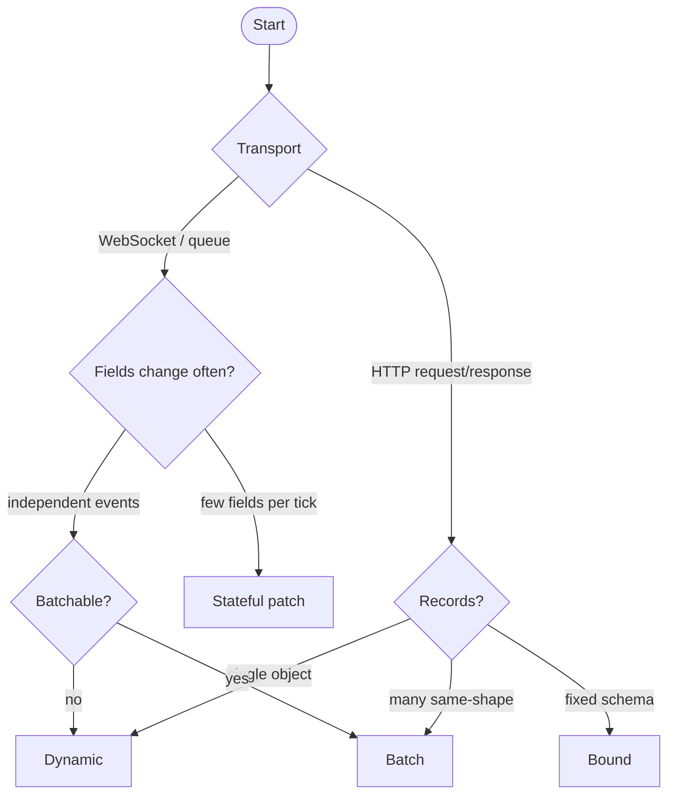

# Encoding Profiles

Twilic v3 defines three primary data profiles and one optional stateful profile. Each profile trades off flexibility, wire size, and session requirements differently. Pick the profile that matches your transport and data shape — not the other way around.

## Profile overview

| Profile | Schema required | Session required | Best for |
| --- | --- | --- | --- |
| **Dynamic** | No | No | Ad-hoc values, single objects, first adoption |
| **Batch** | No, or yes for `SCHEMA_BATCH` | No | Same-shape record lists, API pages, cache snapshots |
| **Bound** | Yes | No | Fixed message types, payment events, max density |
| **Stateful** | No | Yes | WebSocket ticks, incremental entity sync |

Rust, Go, JavaScript, and Zig emit v3 by default. Other published SDKs may still emit v2 payloads. For new spec-level work, use the [v3 reference profile](/spec/v3) and explicitly signal version/profile when v2 and v3 coexist.

## Dynamic Profile

The default. Encode any [TwilicValue](/reference/value-and-schema) tree without prior agreement on shape.

```ts
import { encode, decode } from "@twilic/core";
const bytes = encode({ id: 1n, name: "alice" });
```

**Wire behavior:**

- First occurrence of each shape sends field names
- Repeated strings within a message are interned
- Homogeneous numeric arrays may auto-select typed vector codecs
- No cross-message state

**Use when:** single HTTP bodies, one-off cache entries, prototyping.

## Batch Profile

Encodes multiple same-shape records as one message with shared shape definition.

```ts
import { encodeBatch } from "@twilic/core/advanced";
const bytes = encodeBatch(records);
```

**Wire behavior:**

- Field names sent once per batch
- String interning across all records
- Dynamic row batch (`row_batch`), dynamic columnar batch (`col_batch`), or schema-aware `SCHEMA_BATCH` selected by encoder/profile

**Size vs MessagePack** (same-shape records):

| Records | Approx. size vs MessagePack |
| ------- | --------------------------- |
| 10      | 60–70%                      |
| 100     | 30–40%                      |
| 1,000   | 20–30%                      |

**Use when:** list API responses, telemetry flushes, bulk cache warm-up.

See [Batch & Columnar](/guide/batch-and-columnar).

## Bound Profile

Schema-aware encoding. Field names omitted; positions and types come from a [Schema](/reference/value-and-schema).

```ts
import { encodeWithSchema } from "@twilic/core/advanced";
const bytes = encodeWithSchema(schema, value);
```

**Wire behavior:**

- Field names not sent
- Enum fields encode as bit indices
- `BOUND_STREAM` binds one schema for consecutive compact record bodies
- Enum, bool, and `range_bits` fields coalesce into compact bit groups
- Comparable to Protobuf/Avro density on schema-fixed streams under equivalent framing assumptions

**Use when:** payment messages, fixed RPC contracts, hot paths with stable structure.

See [Schema-Bound Encoding](/guide/schema-bound).

## Stateful Profile

Maintains encoder/decoder state across an ordered message sequence.

```ts
import { createSessionEncoder } from "@twilic/core";
const enc = createSessionEncoder();
enc.encode(fullValue); // baseline
enc.encodePatch(updated); // changed fields only
enc.reset(); // after disconnect
```

**Wire behavior:**

- State patches reference previous message or base snapshot
- Trained dictionaries accumulate across session
- Template batches reuse column templates

**Use when:** WebSocket dashboards, game state sync, live metrics.

::: danger Not for HTTP Stateful profile requires ordered delivery and persistent session state. Do not use on stateless HTTP request/response. :::

See [Stateful Streams](/guide/stateful-streams).

## Decision flowchart



## Profile progression

Typical adoption path:

```text
1. Dynamic everywhere (drop-in MessagePack replacement)
2. Batch on list/bulk endpoints
3. Stateful on WebSocket products
4. Bound/`BOUND_STREAM` on 2–3 latency-critical fixed messages
```

## SDK entrypoints by profile

| Profile | JavaScript | Rust | Python | Go |
| --- | --- | --- | --- | --- |
| Dynamic | `encode()` | `encode()` | `encode()` | `Encode()` |
| Batch | `encodeBatch()` | `encode_batch()` | `encode_batch()` | `EncodeBatch()` |
| Bound | `encodeWithSchema()` | `encode_with_schema()` | `encode_with_schema()` | via SessionEncoder |
| Stateful | `createSessionEncoder()` | `create_session_encoder()` | `create_session_encoder()` | `NewSessionEncoder()` |

## Related

- [Core Concepts](/guide/concepts)
- [Encoder Selection](/guide/encoder-selection)
- [Trained Dictionaries](/guide/trained-dictionaries)
- [Cookbook](/guide/cookbook)
- [Spec — Profiles](/spec/profiles)
