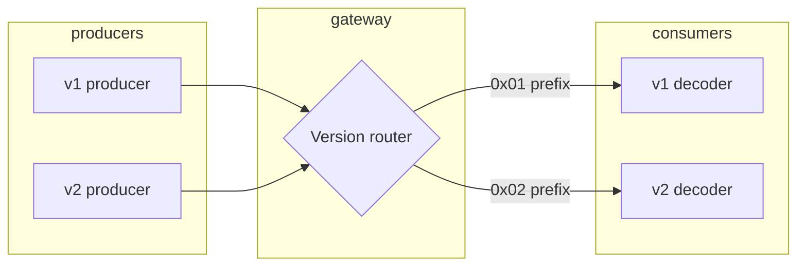

# v1 → v2 Migration Runbook

Twilic v2 is a **clean break** from v1. A v2 decoder is not required to decode v1 payloads. This runbook helps teams running v1 implementations plan a safe migration.

For spec-level differences, see [v1 Legacy](/spec/v1) and [v2 Reference Profile](/spec/v2).

## Key breaking changes

| Area | v1 | v2 |
| --- | --- | --- |
| Wire model | Top-level message-kind envelope byte | Tag-table model, no envelope |
| Key interning | Session-scoped | Message-local (resets per message) |
| Shape interning | Control-message driven | Explicit `shape_def` / `shape_ref` |
| String interning | Session-scoped | Message-local |
| Batch | Via control messages | Explicit `row_batch` / `col_batch` tags |
| Stateful | Integrated in control flow | Optional separate profile |

## Pre-migration checklist

- [ ] Inventory all v1 producers and consumers
- [ ] Identify session-scoped decode assumptions (v1 intern tables)
- [ ] List endpoints using control-message batching
- [ ] Confirm SDK versions — target v2-line releases
- [ ] Set up dual-format decode path (version byte or content type)

## Migration strategy

Run v1 and v2 **in parallel** during transition. Do not in-place upgrade wire format on live sessions.



### Version prefix convention

Application-level framing during migration:

```text
0x01 = Twilic v1 payload
0x02 = Twilic v2 Dynamic
```

Decoders branch on the first byte. Remove v1 branch after all producers migrate.

Alternative: separate content types or URL paths (`/v1/` vs `/v2/`).

## Step-by-step migration

### Step 1: Deploy v2 decoders (read path)

Deploy consumers that accept **both** v1 and v2:

```ts
function decodePayload(bytes: Uint8Array) {
  if (bytes[0] === 0x02) {
    return decodeV2(bytes.subarray(1));
  }
  if (bytes[0] === 0x01) {
    return decodeV1(bytes.subarray(1));
  }
  throw new Error("unknown format version");
}
```

No producer changes yet. Validates v2 decode path in production.

### Step 2: Migrate stateless endpoints first

v1 session-scoped interning affects stateless messages least when each message is self-contained. Start with:

- Cache values (per-key stateless encode)
- One-shot HTTP responses
- Job payloads without cross-message references

Replace v1 `encode()` with v2 `encode()` — message-local interning means decoders need no session state.

### Step 3: Replace control-message batching

v1 batch via control messages → v2 explicit tags:

| v1 pattern | v2 replacement |
| --- | --- |
| Control-driven batch | `encodeBatch()` → `row_batch` |
| Large tabular batch | `encodeBatch()` with columnar selection → `col_batch` |
| Micro-batch in stream | `encodeMicroBatch()` → `template_batch` |

Verify roundtrip with [conformance fixtures](/guide/conformance).

### Step 4: Migrate stateful streams

Stateful migration requires **simultaneous** producer and consumer upgrade on each stream:

1. Drain or restart existing WebSocket sessions
2. Deploy v2 session encoder/decoder pair
3. First frame: v2 full `encode()` (stateless-compatible)
4. Resume v2 `encodePatch()` / trained dictionaries

Call `reset()` on both sides after reconnect. See [Stateful Decoding](/guide/stateful-decoding).

v1 session state **does not** carry forward to v2.

### Step 5: Replace shape registration

v1 implicit shape registration via control messages:

```text
v1: control message registers shape → subsequent objects reference shape id
v2: shape_def (0xD6) on first occurrence → shape_ref (0xD7) thereafter
```

Encoder auto-selection handles this in v2 SDKs — no manual control messages.

### Step 6: Retire v1 producers

After all consumers decode v2:

- Remove v1 encode paths
- Remove version prefix `0x01` branch
- Delete v1-specific session state management

## SDK upgrade matrix

| SDK           | v2 status | Notes                      |
| ------------- | --------- | -------------------------- |
| twilic-rust   | Reference | Full v2 profile            |
| twilic-js     | Primary   | `@twilic/core` targets v2  |
| twilic-python | Primary   | v2 default                 |
| twilic-go     | Primary   | v2 default                 |
| twilic-java   | Primary   | v2 default                 |
| twilic-c      | Primary   | v2 default `twilic_encode` |

Check each SDK's CHANGELOG for v1 deprecation timeline.

## Testing during migration

### Cross-format smoke tests

```bash
# v2 encode → v2 decode (all SDKs)
cd twilic-rust && cargo test

# Interop fixtures
cd twilic-python && ./scripts/check-interop.sh
```

### Regression suite

1. Capture production payload samples (anonymized)
2. Encode with v2, decode with v2 — compare semantic equality
3. Compare v2 size vs v1 size on same logical values
4. Run [benchmark fixtures](/benchmark/fixtures) before/after

### Stateful stream test

1. Connect v2 producer + v2 consumer
2. Send 20 ticks with patches
3. Disconnect, reconnect, verify `reset()` + full frame recovery
4. Confirm no v1 session IDs leak across reconnect

## Rollback

If v2 migration causes issues on an endpoint:

1. Revert producer to v1 encode (version prefix `0x01`)
2. Consumers still support v1 decode branch
3. Investigate — common issues:
   - v1 session decoder used on v2 patch frames
   - Missing `bigint` for u64 in JavaScript
   - Bound schema mismatch

## Timeline template

| Week | Action                                   |
| ---- | ---------------------------------------- |
| 1    | Inventory, deploy dual decode            |
| 2–3  | Migrate stateless cache + HTTP endpoints |
| 4    | Migrate batch list APIs                  |
| 5–6  | Migrate stateful streams (per product)   |
| 7    | Remove v1 encode, monitor                |
| 8    | Remove v1 decode branch                  |

Adjust per team size and traffic criticality.

## Related

- [v1 Legacy spec](/spec/v1)
- [v2 Reference Profile](/spec/v2)
- [Interop](/guide/interop)
- [Conformance](/guide/conformance)
- [Stateful Decoding](/guide/stateful-decoding)
