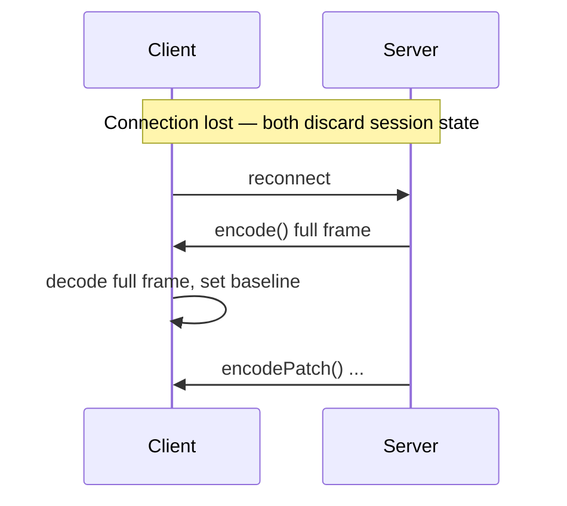

# Stateful Decoding

Stateful encoding sends full frames and patches over an ordered channel. **Decoding** requires matching session state on the receiver — this guide covers how patches work on the consumer side, language support, and recovery patterns.

For the producer side, see [Stateful Streams](/guide/stateful-streams).

## What the receiver must do

```text
1. Maintain session decoder state across frames (same order as producer)
2. First frame: decode as full Dynamic message → store as baseline
3. Patch frames: apply operations against baseline → update stored value
4. On disconnect or decode error: discard state, wait for new full frame
```

Patches are not self-contained. A patch frame references field IDs and base snapshots from prior frames in the same session.

## Language support

| Language | Full frame decode | Patch decode | Session decoder API |
| --- | --- | --- | --- |
| Rust | ✓ `decode()` | ✓ `SessionDecoder::decode()` | `create_session_decoder()` |
| JavaScript | ✓ `decode()` | ✓ `SessionDecoder.decode()` | `createSessionDecoder()` |
| Python | ✓ `decode()` | ✓ via `TwilicCodec.decode_message()` | codec-level today |
| Go | ✓ `Decode()` | ✓ via `TwilicCodec.DecodeMessage()` | codec-level today |
| Java | ✓ `decode()` | ✓ via codec / session message decode | codec-level today |

Dedicated `createSessionDecoder()` is the recommended public API in Rust and JavaScript. Other runtimes can decode stateful frames through their existing `decode_message` / `DecodeMessage` paths until a matching factory is published.

## JavaScript receiver example

```ts
import { createSessionDecoder, init } from "@twilic/core";
import { createTwilicWebSocket } from "@twilic/websocket";

await init();

// Prefer the WebSocket helper when both peers use Twilic stateful mode:
const twilic = createTwilicWebSocket({ stateful: true });
twilic.attach(socket, (value) => {
  renderDashboard(value);
});

// Or manage the decoder directly:
const dec = createSessionDecoder({
  unknownReferencePolicy: "statelessRetry",
});

for (const frame of incomingFrames) {
  try {
    const value = dec.decode(frame);
    renderDashboard(value);
  } catch (error) {
    if (String(error).includes("stateless retry")) {
      requestFullSnapshot();
      continue;
    }
    console.error(error);
  }
}
```

## Rust receiver example

```rust
use twilic::{create_session_decoder, SessionOptions};

let mut dec = create_session_decoder(SessionOptions::default());

for frame in incoming_frames {
    match dec.decode(&frame) {
        Ok(value) => {
            // Full frame or successfully applied patch
            render_dashboard(&value);
        }
        Err(e) if e.to_string().contains("StatelessRetryRequired") => {
            // Unknown base reference — request full frame from producer
            request_full_snapshot();
        }
        Err(e) => eprintln!("decode error: {e}"),
    }
}
```

Low-level message decode for debugging:

```rust
use twilic::{TwilicCodec, Message};

let mut codec = TwilicCodec::default();
let msg = codec.decode_message(&bytes)?;
// Inspect Message::StatePatch { base_ref, operations, .. }
```

## Python receiver example

```python
import twilic

codec = twilic.TwilicCodec()

for frame in incoming_frames:
    try:
        message = codec.decode_message(frame)
        # Reconstruct application values from Message / previous state as needed
        render_dashboard(message)
    except twilic.ErrStatelessRetryRequired:
        request_full_snapshot()
```

## Go receiver example

```go
codec := twilic.TwilicCodecWithOptions(twilic.DefaultSessionOptions())

for _, frame := range incomingFrames {
    msg, err := codec.DecodeMessage(frame)
    if err != nil {
        if twilic.IsStatelessRetryRequired(err) {
            requestFullSnapshot()
            continue
        }
        log.Printf("decode error: %v", err)
        continue
    }
    renderDashboard(msg)
}
```

## UnknownReferencePolicy

When the decoder encounters a base ID, shape reference, or dictionary ID it does not know:

| Policy | Behavior |
| --- | --- |
| `failFast` (default) | Decode error immediately |
| `statelessRetry` | Returns `StatelessRetryRequired` — receiver requests full frame |

Configure on both producer and consumer for consistent behavior:

```ts
createSessionDecoder({ unknownReferencePolicy: "statelessRetry" });
```

See [Session Decoder](/reference/session-decoder) and [Session Encoder](/reference/session-encoder).

## Recovery protocol

Implement this on both sides after disconnect or state drift:



### Client-side recovery

```ts
const dec = createSessionDecoder();
let awaitingBaseline = true;

ws.onmessage = (event) => {
  const bytes = new Uint8Array(event.data);

  try {
    const value = dec.decode(bytes);
    awaitingBaseline = false;
    render(value);
  } catch {
    awaitingBaseline = true;
    dec.reset();
    ws.send(JSON.stringify({ type: "request_snapshot" }));
  }
};

ws.onopen = () => {
  awaitingBaseline = true;
  dec.reset();
};
```

### Server-side recovery

```ts
enc.reset(); // clear encoder state
ws.send(enc.encode(currentMetrics)); // full baseline
// resume encodePatch() on subsequent ticks
```

## WebSocket demo

The [examples repository](https://github.com/twilic/examples) includes:

```bash
pnpm example:websocket:simulate   # size comparison (recommended first)
pnpm example:websocket            # live server
pnpm example:websocket:client     # client logs frame sizes
```

With `@twilic/websocket` `{ stateful: true }`, both peers can round-trip patches end to end. The simulate script remains useful for size comparison without a live socket.

## When to decode stateful vs stateless

| Frame type | Decoder |
| --- | --- |
| First frame after connect | Session `decode()` or stateless `decode()` on a full frame |
| Patch frame | Session decoder with accumulated state |
| Batch in stream | Session `decode()` or stateless `decode()` depending on message kind |
| HTTP response body | Always stateless `decode()` |

## Related

- [Stateful Streams](/guide/stateful-streams)
- [Session Decoder](/reference/session-decoder)
- [Session Encoder](/reference/session-encoder)
- [Transport & Framing](/guide/transport-framing)
- [Troubleshooting](/guide/troubleshooting)
