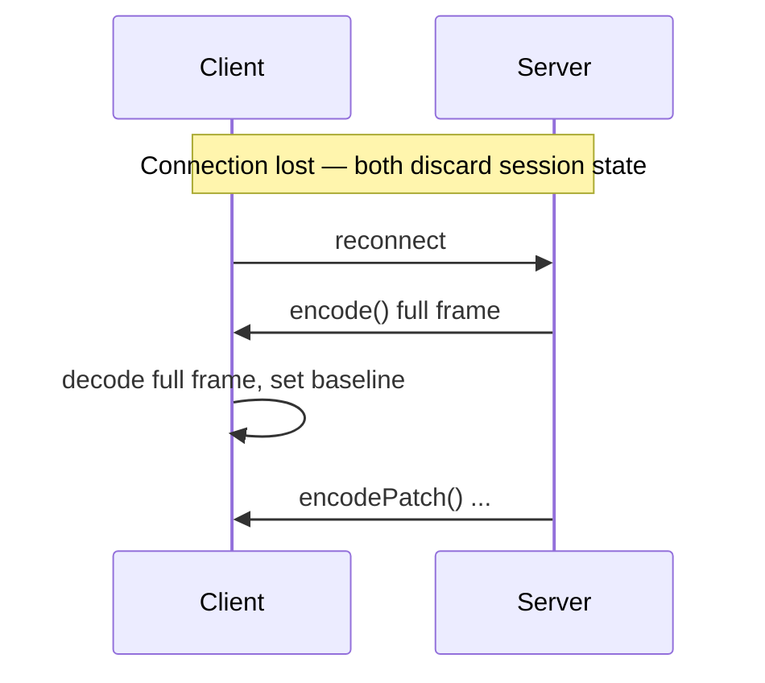

# Stateful Decoding

Stateful encoding sends full frames and patches over an ordered channel. **Decoding** requires matching session state on the receiver — this guide covers how patches work on the consumer side, language support, and recovery patterns.

For the producer side, see [Stateful Streams](/guide/stateful-streams).

## What the receiver must do

```text
1. Maintain session decoder state across frames (same order as producer)
2. First frame: decode as full Dynamic message → store as baseline
3. Patch frames: apply operations against baseline → update stored value
4. On disconnect or decode error: discard state, wait for new full frame
```

Patches are not self-contained. A patch frame references field IDs and base snapshots from prior frames in the same session.

## Language support

| Language | Full frame decode | Patch decode | Session decoder API |
| --- | --- | --- | --- |
| Rust | ✓ `decode()` | ✓ `SessionEncoder::decode_message()` | `TwilicCodec`, `SessionEncoder` |
| Python | ✓ `decode()` | ✓ `decode_message()` | `TwilicCodec`, `SessionEncoder` |
| Go | ✓ `Decode()` | ✓ `DecodeMessage()` | `TwilicCodec`, `SessionEncoder` |
| Java | ✓ `decode()` | ✓ via `SessionEncoder` | `SessionEncoder` |
| JavaScript | ✓ `decode()` | Limited — encode APIs primary | `createSessionEncoder()` |

::: info JavaScript note `@twilic/core` currently exposes session **encode** APIs (`encode`, `encodePatch`, `encodeMicroBatch`). For WebSocket clients that need patch decode in JS, use [simulate mode](https://github.com/twilic/examples) to evaluate savings, or decode on a Rust/Go/Python backend service. :::

## Rust receiver example

```rust
use twilic::{create_session_encoder, SessionOptions, Value};

let mut dec = create_session_encoder(SessionOptions::default());

for frame in incoming_frames {
    match dec.decode(&frame) {
        Ok(value) => {
            // Full frame or successfully applied patch
            render_dashboard(&value);
        }
        Err(e) if e.to_string().contains("StatelessRetryRequired") => {
            // Unknown base reference — request full frame from producer
            request_full_snapshot();
        }
        Err(e) => eprintln!("decode error: {e}"),
    }
}
```

Low-level message decode for debugging:

```rust
use twilic::{TwilicCodec, Message};

let mut codec = TwilicCodec::default();
let msg = codec.decode_message(&bytes)?;
// Inspect Message::StatePatch { base_ref, operations, .. }
```

## Python receiver example

```python
import twilic

dec = twilic.create_session_encoder()

for frame in incoming_frames:
    try:
        value = dec.decode(frame)
        render_dashboard(value)
    except twilic.ErrStatelessRetryRequired:
        request_full_snapshot()
```

## Go receiver example

```go
dec := twilic.NewSessionEncoder(twilic.SessionOptions{})

for _, frame := range incomingFrames {
    value, err := dec.Decode(frame)
    if err != nil {
        if twilic.IsStatelessRetryRequired(err) {
            requestFullSnapshot()
            continue
        }
        log.Printf("decode error: %v", err)
        continue
    }
    renderDashboard(value)
}
```

## UnknownReferencePolicy

When the decoder encounters a base ID, shape reference, or dictionary ID it does not know:

| Policy | Behavior |
| --- | --- |
| `failFast` (default) | Decode error immediately |
| `statelessRetry` | Returns `StatelessRetryRequired` — receiver requests full frame |

Configure on both producer and consumer for consistent behavior:

```ts
createSessionEncoder({ unknownReferencePolicy: "statelessRetry" });
```

See [Session Encoder](/reference/session-encoder).

## Recovery protocol

Implement this on both sides after disconnect or state drift:



### Client-side recovery

```ts
let awaitingBaseline = true;

ws.onmessage = (event) => {
  const bytes = new Uint8Array(event.data);

  if (awaitingBaseline) {
    const value = decode(bytes); // stateless decode works on full frames
    baseline = value;
    awaitingBaseline = false;
    render(value);
    return;
  }

  try {
    const value = applySessionPatch(baseline, bytes); // language SDK
    baseline = value;
    render(value);
  } catch {
    awaitingBaseline = true;
    ws.send(JSON.stringify({ type: "request_snapshot" }));
  }
};

ws.onopen = () => {
  awaitingBaseline = true;
};
```

### Server-side recovery

```ts
enc.reset(); // clear encoder state
ws.send(enc.encode(currentMetrics)); // full baseline
// resume encodePatch() on subsequent ticks
```

## WebSocket demo

The [examples repository](https://github.com/twilic/examples) includes:

```bash
pnpm example:websocket:simulate   # size comparison (recommended first)
pnpm example:websocket            # live server
pnpm example:websocket:client     # client logs frame sizes
```

The simulate script compares JSON, full `encode()`, and `encodePatch()` per tick without requiring patch decode on the client.

## When to decode stateful vs stateless

| Frame type | Decoder |
| --- | --- |
| First frame after connect | Stateless `decode()` — works in all SDKs |
| Patch frame | Session decoder with accumulated state |
| Batch in stream | Session `decode()` or stateless `decode()` depending on message kind |
| HTTP response body | Always stateless `decode()` |

## Related

- [Stateful Streams](/guide/stateful-streams)
- [Session Encoder](/reference/session-encoder)
- [Transport & Framing](/guide/transport-framing)
- [Troubleshooting](/guide/troubleshooting)
