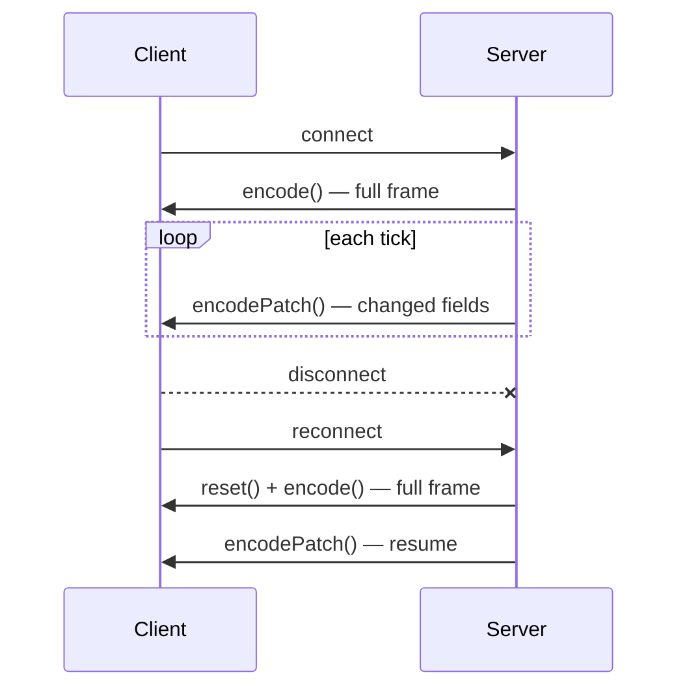

# Session Encoder

The session encoder maintains state across a sequence of messages on a long-lived channel. It enables state patches (send only changed fields), micro-batches, template batches, and trained dictionaries.

Use session encoding for **WebSocket streams**, **ordered message queues**, and **persistent RPC channels** — not for stateless HTTP.

## SessionOptions

Configure session behavior when creating an encoder.

### TypeScript

```ts
interface SessionOptions {
  maxBaseSnapshots?: number;
  enableStatePatch?: boolean;
  enableTemplateBatch?: boolean;
  enableTrainedDictionary?: boolean;
  unknownReferencePolicy?: "failFast" | "statelessRetry";
}
```

### Rust

```rust
pub struct SessionOptions {
    pub max_base_snapshots: usize,
    pub enable_state_patch: bool,
    pub enable_template_batch: bool,
    pub enable_trained_dictionary: bool,
    pub unknown_reference_policy: UnknownReferencePolicy,
}
```

| Option | Default | Description |
| --- | --- | --- |
| `maxBaseSnapshots` / `max_base_snapshots` | `8` | Maximum retained base snapshots for patch base references |
| `enableStatePatch` / `enable_state_patch` | `true` | Allow state patch messages when few fields change |
| `enableTemplateBatch` / `enable_template_batch` | `true` | Allow template batch encoding for repeated column patterns |
| `enableTrainedDictionary` / `enable_trained_dictionary` | `true` | Learn string dictionaries across the session |
| `unknownReferencePolicy` / `unknown_reference_policy` | `failFast` | Behavior when decoder sees unknown base/shape/dictionary reference |

### UnknownReferencePolicy

| Value | Behavior |
| --- | --- |
| `failFast` | Decode error immediately |
| `statelessRetry` | Signal that receiver should request a full stateless frame and retry |

Use `statelessRetry` on clients that can recover from state drift after reconnect.

## Creating an encoder

### JavaScript

```ts
import { createSessionEncoder } from "@twilic/core";

const enc = createSessionEncoder({
  enableStatePatch: true,
  unknownReferencePolicy: "statelessRetry",
});
```

For all encoding variants (transport-JSON, compact, direct), use [`createSessionEncoder`](/reference/javascript-advanced) from `@twilic/core/advanced`.

### Rust

```rust
use twilic::{create_session_encoder, SessionOptions, UnknownReferencePolicy};

let enc = create_session_encoder(SessionOptions {
    unknown_reference_policy: UnknownReferencePolicy::StatelessRetry,
    ..Default::default()
});
```

### Python

```python
import twilic

enc = twilic.create_session_encoder(
    enable_state_patch=True,
    unknown_reference_policy="statelessRetry",
)
```

### Go

```go
enc := twilic.NewSessionEncoder(twilic.SessionOptions{
    EnableStatePatch: true,
    UnknownReferencePolicy: twilic.UnknownReferencePolicyStatelessRetry,
})
```

## Encode methods

| Method               | When to use                                     |
| -------------------- | ----------------------------------------------- |
| `encode()`           | First frame or after `reset()` — full baseline  |
| `encodePatch()`      | Subsequent ticks when most fields unchanged     |
| `encodeBatch()`      | Multiple same-shape records in one frame        |
| `encodeMicroBatch()` | Small batches in high-frequency streams         |
| `reset()`            | After disconnect, decode error, or version skew |

## Session lifecycle



## Decoder pairing

The receiver must apply patches in order on the same session. If the client does not implement stateful decode:

- It can still decode the **first full frame** as a normal Dynamic message
- Subsequent patches will not decode correctly without session state

## Recovery pattern

```ts
let consecutiveErrors = 0;

function sendUpdate(value: TwilicValue) {
  try {
    const bytes =
      consecutiveErrors > 0
        ? enc.encode(value) // full frame after errors
        : enc.encodePatch(value);
    transport.send(bytes);
    consecutiveErrors = 0;
  } catch {
    consecutiveErrors++;
    enc.reset();
    transport.send(enc.encode(value));
  }
}
```

See [Stateful Streams guide](/guide/stateful-streams) and [Cookbook — Graceful Degradation](/guide/cookbook#graceful-degradation-stateless-fallback).

## Related

- [Transport & Framing](/guide/transport-framing)
- [Troubleshooting](/guide/troubleshooting)
- [Spec — Transport Guide](/spec/transport)
