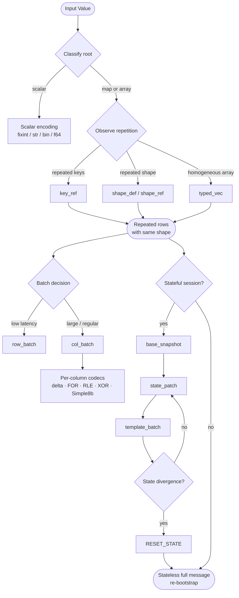

# Profiles

Twilic defines four primary profiles. Profiles compose — a session may use Dynamic for one-shot messages, Bound for schema-aware records, and Batch for bulk transfers.

## Dynamic Profile

The Dynamic Profile is Twilic's default. It behaves like MessagePack: any root value can be sent without a schema, and maps/lists/scalars/binary/strings are all represented directly.

Within a single top-level message, the Dynamic Profile activates structural compression automatically:

- **Key interning** — First-seen map keys are assigned a `key_id`. Repeated keys within the same message use `key_ref` instead of the literal string.
- **Shape interning** — Arrays of same-shape maps use one `shape_def`. Subsequent rows use `shape_ref` and encode only values.
- **String interning** — Repeated string values within the same message use `str_ref`.
- **Typed vectors** — Homogeneous primitive arrays use `typed_vec` with codec selection.

All intern tables reset at each top-level message boundary.

### Usage

Dynamic is the right profile when:

- You do not have a fixed schema.
- You are migrating from JSON or MessagePack.
- You want compression benefits without a schema definition step.

## Bound Profile

The Bound Profile is schema-aware. Sender and receiver share a schema ahead of time. In return:

- Field names are **not sent** — field order is fixed by schema.
- Type tags are **generally not sent** — types are known from schema.
- Required fields are always present; optional fields follow a **presence bitmap**.
- **Range-aware bit packing** — if a field has a known value range, it is stored as `value - min` using the minimum required bit width.

### Schema Definition

Each schema field specifies at minimum:

- Field number and name
- Logical type and physical encoding
- Required vs optional, and default value
- Value range or allowed set (for bit packing)
- String constraints

If the message type is unambiguous from context, `schema_id` may be omitted. Attach it only when mixed message types must be disambiguated.

### Zero-Copy Layout (Optional)

An optional extension within Bound Profile aligns in-memory structure and wire layout, following a Cap'n Proto-like design. Fields are aligned naturally; offsets use relative values for memory-mapping. This reduces decode/encode work at the cost of some size overhead from padding. Use compact layout (default) when minimizing payload size is the primary goal.

## Batch Profile

The Batch Profile bundles multiple records with the same shape or schema into one message.

Two modes are available:

### Row Batch (`row_batch`)

Records are sent row-by-row. Shape or schema is declared once; each row encodes only values.

```text
row_batch [shape_id] [row_count] [row_0_values] ... [row_n_values]
```

Best for: low-latency, moderate-size bursts where column codec gains are small.

### Column Batch (`col_batch`)

Records are stored column-by-column. Each column is encoded with its own codec.

```text
col_batch [shape_id] [row_count] [col_0] ... [col_n]
```

Per-column codecs: `DIRECT_BITPACK`, `DELTA_BITPACK`, `FOR_BITPACK`, `DELTA_FOR_BITPACK`, `DELTA_DELTA_BITPACK`, `RLE`, `PATCHED_FOR`, `SIMPLE8B`, `XOR_FLOAT`.

Best for: larger batches with high column regularity — time series, telemetry, database exports.

## Stateful Profile

The Stateful Profile compresses against previous messages and shared dictionaries over the same stream, session, or channel. It is **optional** — receivers that do not use stateful mode must still handle stateless messages.

Stateful mode requires **ordered delivery** and **no silent drops** of reset or registration frames.

### State Forms

| Form | Tag | Usage |
| --- | --- | --- |
| `state_patch` | `0xDD` | Delta against previous message or explicit base. Beneficial when changed-field ratio is low. |
| `template_batch` | `0xDE` | Micro-batch for repeated schema/shape bursts with optional-field presence patterns. |
| Base snapshot | — | Explicit snapshot registered with `base_id` for stable patch anchors. |

### Reset Behavior

`RESET_STATE` invalidates all state references (bases, templates, dictionaries). After reset, the sender must emit a stateless full frame or fresh registration before sending stateful references again.

### Unknown Reference Policy

Decoder policy must be fixed per deployment:

- **Fail-fast** — decode error on unknown `base_id`, `template_id`, or dictionary id.
- **Stateless retry** — transport/application requests a stateless resend from the sender.

Unknown references must **never** be silently accepted.

## Encoding Flow

The diagram below shows how an encoder progresses from baseline dynamic forms to compact forms as repetition accumulates.


