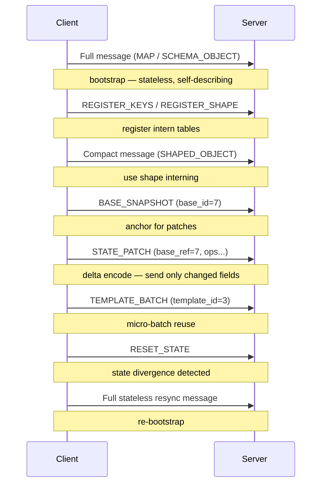

# Transport Guide

This guide describes transport and session behavior for Twilic v2.

## Stateless vs Stateful

**Stateless mode:** every message is self-sufficient. No session state is required. Safe for HTTP, message queues, fire-and-forget transports. Recommended as the default for general usage.

**Stateful mode:** messages may reference prior session state — `base_id`, templates, dictionaries. Requires an ordered, reliable session.

When transport guarantees are weak, the encoder SHOULD remain stateless or use a stateless retry policy.

## Session State

Session state may include:

- Base snapshots (registered with `base_id`)
- Templates (registered with `template_id`)
- Optional dictionary metadata

Per-message key/string/shape interning tables are **message-local** in v2. They are NOT persistent session state.

Session state objects (`base_id`, `template_id`, dictionary IDs) MUST NOT be reused across independent streams.

Session epochs SHOULD be treated as transport-local context and reset on reconnect unless explicitly negotiated.

## Stateful Forms

### `state_patch` (`0xDD`)

Delta payload against the previous message or an explicit base snapshot.

**Typical usage:**

- Hot object streams where the changed-field ratio is low (most fields stay the same between messages)
- Repeated schema emissions with minor updates

**Benefit:** only changed fields are transmitted. On a telemetry stream where 2 of 20 fields change per tick, state patch can reduce payload size by 90%.

### `template_batch` (`0xDE`)

Micro-batch reuse for repeated schema/shape bursts.

**Typical usage:**

- Short burst batches where full column mode is overkill
- Repeated optional-field presence patterns (e.g. most records have fields A/B/C present, rarely D/E)

### Batch Forms (`0xDB` / `0xDC`)

Row and column batches remain available in both session and stateless contexts.

- `row_batch` — suitable for low-latency, moderate-size bursts
- `col_batch` — suitable for larger batches with column codec gains

## Reset Behavior

`RESET_STATE` invalidates all state references (bases, templates, dictionaries).

After reset:

- Both sides MUST treat old state IDs as invalid.
- Sender MUST emit a stateless full frame or fresh registration before sending stateful references.

Reset must be sent reliably. A dropped reset frame leaves sender and receiver in diverged state with no recovery path.

## Unknown Reference Policy

Decoder policy MUST be fixed per deployment:

| Policy | Behavior |
| --- | --- |
| **Fail-fast** | Hard decode error on unknown `base_id`, `template_id`, or dictionary ID |
| **Stateless retry** | Transport/application requests a stateless resend from sender |

Unknown IDs MUST NOT be silently accepted or speculatively repaired.

## Ordering and Reliability

Stateful mode requires:

- **Ordered delivery** for state-mutating frames (base/template registration, patches)
- **No silent drops** of reset or registration frames
- **Bounded retention window** alignment between peers

If any of these guarantees cannot be met, the deployment MUST use stateless mode only.

## Recommended Defaults by Transport

| Transport                     | Recommended mode  |
| ----------------------------- | ----------------- |
| HTTP request/response         | Stateless         |
| Message queue / pub-sub       | Stateless         |
| WebSocket (reliable, ordered) | Stateful optional |
| gRPC streaming                | Stateful optional |
| UDP / unreliable channel      | Stateless only    |

## Session Lifecycle

A typical stateful session follows this sequence:

Operational intent:

- Start stateless for safe bootstrap.
- Register keys/shapes once repetition is observed.
- Use snapshot + patch + template only while state alignment is healthy.
- Reset and resync immediately when unknown references or divergence is detected.
